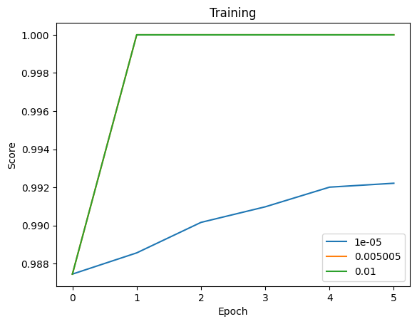

# Сопоставление описания вакансий и резюме

## Описание проекта

Целью данного проекта является обучение модели для сопоставления
описания вакансий и резюме и определения того, насколько хорошо
они подходят друг другу.

## Сбор данных

В интернете много данных о вакансиях и о резюме, однако,
уже готовых данных с разметкой мало. Было решено использовать набор
размеченных вручную данных для обучения. В данных были колонки резюме,
вакансии и информация о том, подходит ли резюме или нет.

## Выбор модели и обучение

Было решено воспользоваться библиотекой sentence_transformers, которая
содержала все необходимые инструменты для решения данной задачи.

За основу была взята модель rubert-tiny2, так как она достаточно хорошо работает,
при небольшом количестве параметров сети.

Функция ошибки - ContrastiveLoss, которая принимает на вход два текста и лейбл 0 или 1.
Если лейбл == 1, расстояние между эмбеддингами уменьшается, если 0 - увеличивается.

Для оценки качества обучения использовался BinaryClassificationEvaluator - оценивает модель
на основе сходства эмбеддингов. Метриками являются косинусное сходство, а также евклидово
и манхэттенское расстояние. Возвращаемый скор представляет собой точность с заданной метрикой.

Также осуществлялся некоторый перебор гиперпараметров, а именно - learning rate.

